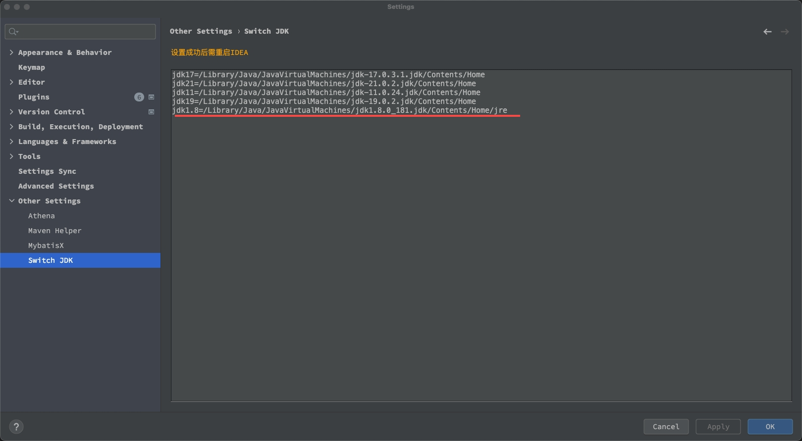
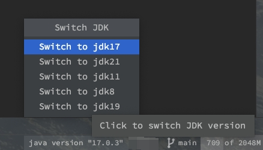

## SwitchJdk - Quick JDK Version Switcher

This plugin allows you to quickly switch between different JDK versions in IntelliJ IDEA.

### Configuration Steps:

1. Go to **Settings > Other Settings > Switch Sdk**
2. Configure your JDK paths in the following format:
   ```properties
   jdk8=/path/to/jdk8/home/jre
   jdk17=/path/to/jdk17/home
   jdk21=/path/to/jdk21/home
   jdk11=/path/to/jdk11/home
   jdk19=/path/to/jdk19/home
   
3. Restart idea

### Example Configuration:(Notice! There are slight differences in jdk8 configuration)
   ```properties
    jdk8=/Library/Java/JavaVirtualMachines/jdk1.8.0_181.jdk/Contents/Home/jre
    jdk17=/Library/Java/JavaVirtualMachines/jdk-17.0.3.1.jdk/Contents/Home
    jdk21=/Library/Java/JavaVirtualMachines/jdk-21.0.2.jdk/Contents/Home
    jdk11=/Library/Java/JavaVirtualMachines/jdk-11.0.24.jdk/Contents/Home
    jdk19=/Library/Java/JavaVirtualMachines/jdk-19.0.2.jdk/Contents/Home
```

### After configuration, you can quickly switch JDK versions using the status bar widget.

### Illustration




### Change Log

```markdown
1.2025-29-05 Added the optional function to change the Java version of the mac system, which is not selected by default.
```